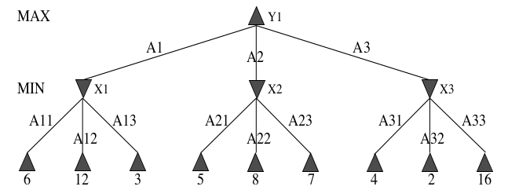

# CS26110 Assignment 2010/11

**Submission:** Submit your assignment on Wednesday 17th November between the hours of 12.00 and 1.00 in the postbox in reception. Every piece of coursework MUST have a completed Departmental cover sheet showing information about the coursework, your student reference number, name and signature which is available from the intranet under Teaching and Resources. Your name and signature should be folded over and sealed to make your assignment anonymous.

**Assessment:** Assessment for CS26110 is by examination (70%) and this piece of assessed work (30%). This assignment will be marked out of 60.

## Assignment Part 1

Figure 1 shows a 2-ply tree generated for game playing between two players, MAX and MIN. The numbers at each leaf node are the values obtained by applying a utility function to each terminal state, with higher numbers showing a better result for MAX.

1. Using the tree in figure 1, and the minimax algorithm, what are the utility values for the nodes X1, X2, X3 and Y1? [4 marks]
2. Which branch should MAX follow in order to make his best first move? Following this move by MAX, which branch would then be the best choice for MIN? [4]
3. Using the tree in Figure 1, state which branches would not be examined during alpha-beta pruning and give an explanation as to why not. [6]
4. Why are heuristics important in the area of search? [6]
5. What problems are encountered when using heuristics and how can these be overcome? Give examples to illustrate your answer. [10]

## Assignment Part 2

"Somewhere near Hanoi there is a monastery whose monks devote their lives to a very important task. In their courtyard are three tall posts. On these posts is a set of disks, each with a hole in the center and each of a different radius. When the monastery was established, all of the disks were on one of the posts, each disk resting on the one just larger than it. The monks’ task is to move all of the disks to one of the other pegs. Only one disk may be moved at a time, and all the other disks must be on one of the other pegs. In addition, at no time during the process may a disk be placed on top of a smaller disk. The third peg can, of course, be used as a temporary resting place for the disks."

The above problem can be solved using various search strategies. With reference to the shape of the state space, and factors such as time and space complexity, completeness and optimality, choose which method(s) would be most appropriate for the monks to follow to solve their problem. Provide a full discussion of alternative methods you have considered and their advantages and disadvantages for the task above. [30 marks]
